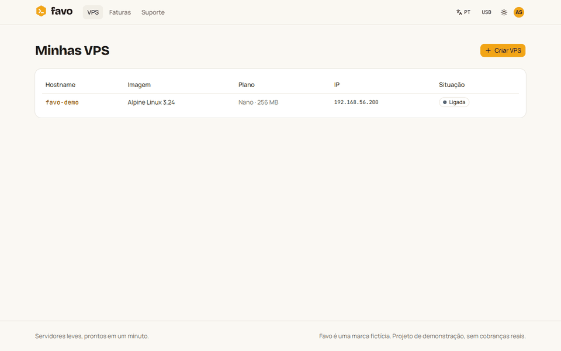
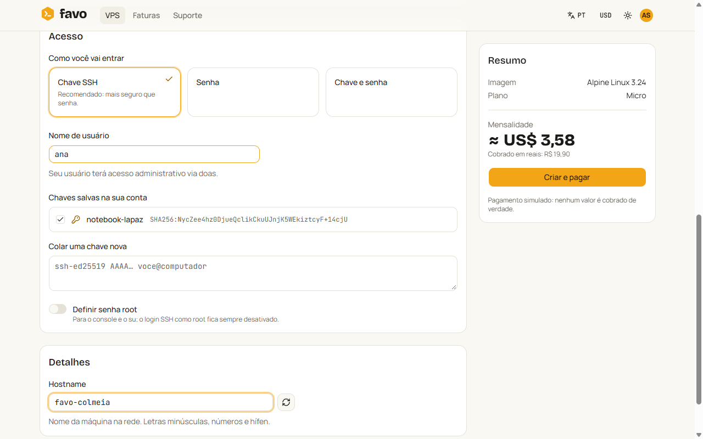
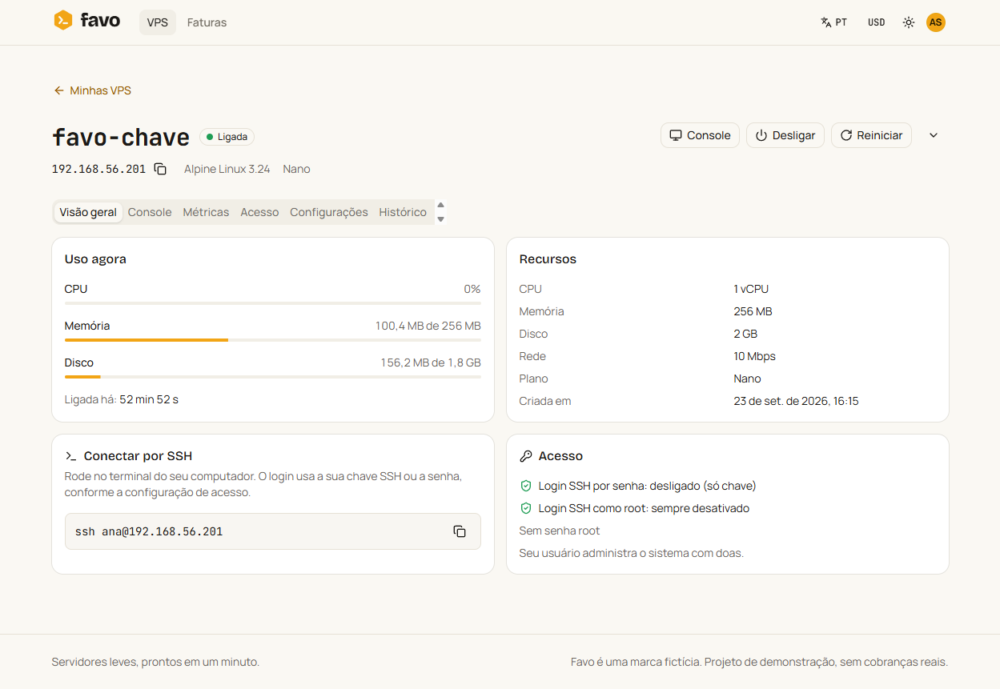
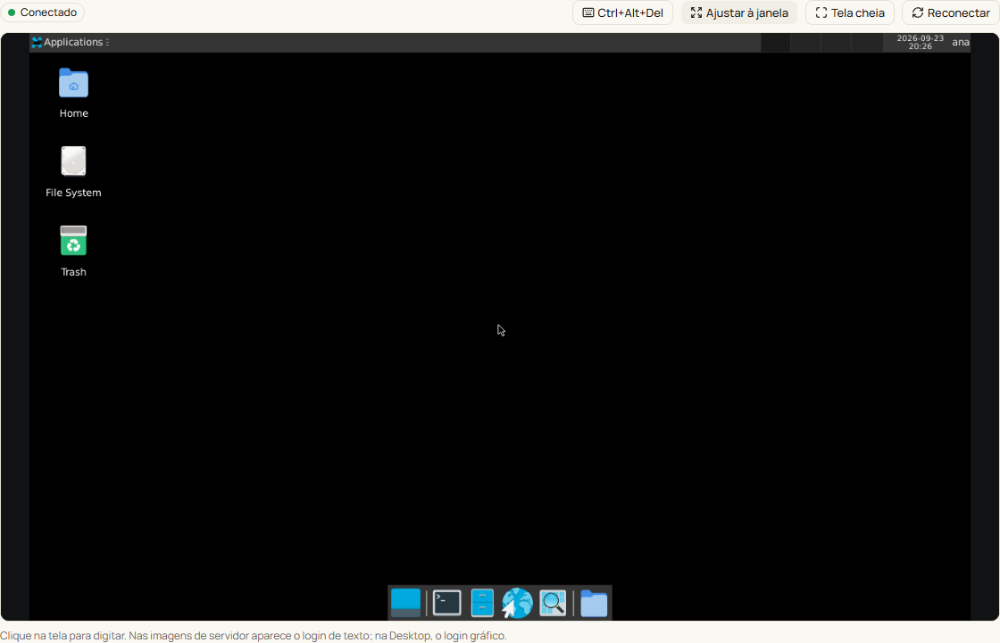
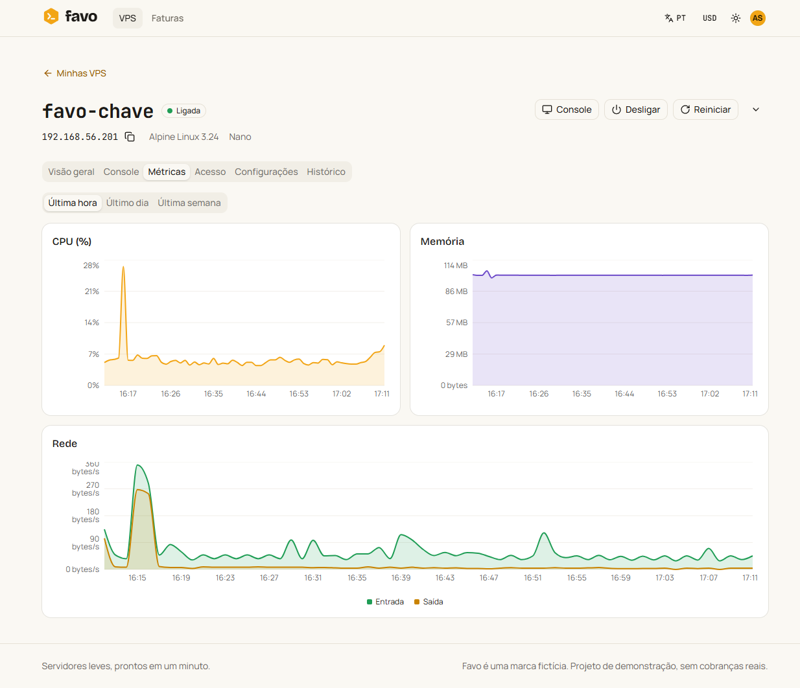
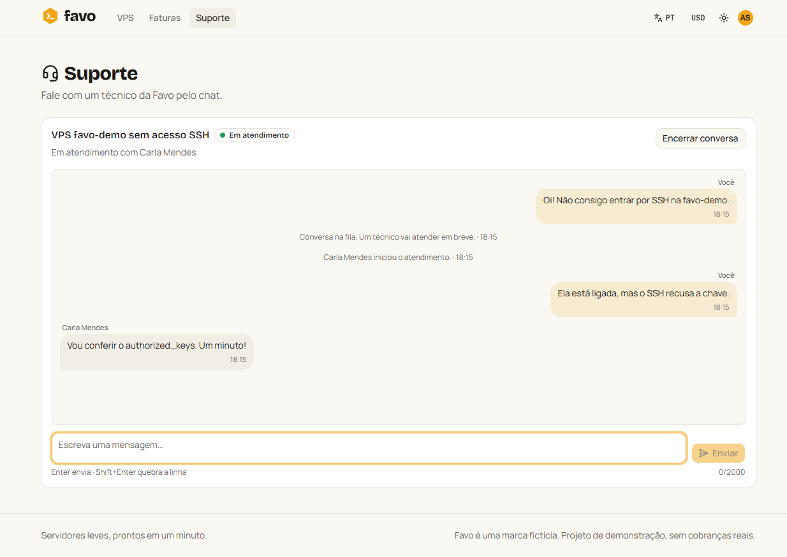
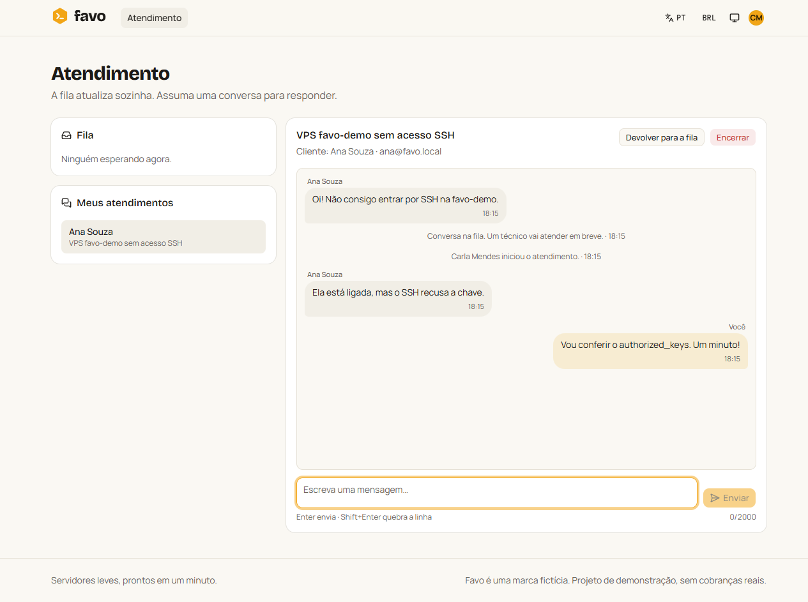
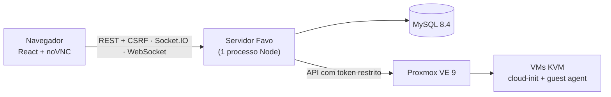

# Favo — plataforma de aluguel de VPS

> **In English:** Favo is a project that simulates a VPS hosting provider end to end: sign-up, simulated
> billing, and **real KVM virtual machines** provisioned on a Proxmox VE lab (cloud-init, guest agent), with live status
> over Socket.IO, an in-browser noVNC console proxied through the backend, and a support chat with a live queue.
> Stack: Node 24 · Express 5 · React 19 · Vite 8 · TypeScript 7 · Prisma 7 + MySQL 8.4 · Socket.IO · Proxmox VE 9.

A **Favo** é uma provedora de VPS fictícia. O cliente cria a conta, escolhe
imagem e plano, paga (pagamento simulado) e, em cerca de meio minuto, tem uma **VM KVM de verdade** rodando num
laboratório Proxmox, acessível por SSH e pelo console no navegador. Tudo em pt-BR, en-US e es-ES.



## O que dá para fazer

- **Criar VPS** em uma página só, no estilo dos provedores reais: imagem (Alpine, Debian 13, Ubuntu 24.04 e Alpine
  com XFCE), plano, chave SSH e/ou senha, senha root opcional e hostname. Os mínimos de cada imagem valem na tela e no
  servidor.
- **Pagar** com cartões de teste (aprovado, recusado, saldo insuficiente). O valor é sempre cobrado em BRL; USD e EUR
  aparecem só como referência.
- **Acompanhar a criação ao vivo**: IP, cópia da imagem, configuração, boot, acesso e pronta, sem recarregar a página.
- **Gerenciar**: ligar, desligar, reiniciar (com confirmação), trocar de plano (o disco cresce com a VM ligada),
  renomear, redefinir senhas, ligar/desligar SSH por senha, adicionar chaves e excluir (digitando o hostname).
- **Console no navegador**: gráfico (noVNC), inclusive o login gráfico da imagem Desktop, ou de texto (xterm.js na
  porta serial da VM).
- **Anti-spoofing de rede**: cada VPS só consegue usar o próprio IP e MAC (firewall do Proxmox por VM).
- **Métricas** de CPU, memória e rede, e o histórico de eventos da VPS.
- **Suporte**: o cliente abre um chat e entra na fila; os técnicos veem a fila ao vivo e assumem os atendimentos. O
  técnico não tem acesso a VPS nem a faturas.
- **Administração** de usuários e roles (RBAC por permissão).

| | |
|---|---|
|  |  |
|  |  |
|  |  |

## Arquitetura em uma imagem



Um único processo Node serve a API, o Socket.IO, o proxy do console e a SPA, e roda o worker da fila de jobs (no próprio
MySQL, com `SELECT … FOR UPDATE SKIP LOCKED`). Detalhes, diagramas de sequência e a máquina de estados estão em
[docs/arquitetura.md](docs/arquitetura.md); a revisão de segurança (OWASP Top 10), em [docs/seguranca.md](docs/seguranca.md).

### Decisões que valem a leitura

- **Provisionamento idempotente e retomável:** cada etapa grava um checkpoint e confere o estado real no Proxmox antes
  de agir. Matar o servidor no meio da criação e subir de novo termina a mesma VM, sem duplicar.
- **Console sem expor o Proxmox:** sessão de uso único (30 s, presa à sessão de login) e proxy WebSocket no backend. O
  token do Proxmox nunca sai do servidor.
- **Cloud-init só no primeiro boot:** o laboratório mostrou que renomear a VM fazia o cloud-init rodar de novo e trocar
  as chaves de host SSH. Depois da criação, tudo é feito pelo guest agent, com comandos fixos por imagem.
- **CSRF "Signed Double-Submit Cookie"** ligado à sessão, sessão no banco só como hash e RBAC por permissão.
- **Tudo conferido no laboratório:** cada comportamento do Proxmox foi verificado no schema oficial da API e testado
  numa VM real; as armadilhas encontradas estão documentadas no [plano](docs/PLANO_DE_IMPLEMENTACAO.md) e no
  [CLAUDE.md](CLAUDE.md).

## Stack

| Área | Tecnologias |
|---|---|
| Frontend | React 19.3, Vite 8.3, Tailwind 4.3, shadcn, TanStack Query 5, React Router 8.4, i18next 26, recharts 3, noVNC 1.7 |
| Backend | Node 24, Express 5.2, TypeScript 7.0, tsyringe, zod 4, pino, helmet, argon2, Socket.IO 4.8, ws 8 |
| Dados | MySQL 8.4, Prisma 7.10 (adapter MariaDB) |
| Infraestrutura | Proxmox VE 9.2 (dentro do VirtualBox, com KVM aninhado), templates cloud-init |
| Qualidade | Vitest 5, supertest, Playwright 1.63, Biome 2.5 |

## Como rodar

### Requisitos

- Node 24 e MySQL 8.4.
- Para criar VPS de verdade, um Proxmox VE 9 acessível. O laboratório usado (Proxmox numa VM do VirtualBox, rede
  host-only e templates) está descrito no [plano, seções 2 e 3](docs/PLANO_DE_IMPLEMENTACAO.md); os scripts
  `scripts/pve/bootstrap.sh` e `scripts/pve/build-template.sh` preparam o token, os pools e os quatro templates.

### Passos

```bash
npm install                         # também gera o Prisma Client
cp .env.example .env.development    # preencha DATABASE_URL, segredos e os dados do Proxmox
npm run db:setup:dev                # migrations + seed (planos, imagens e usuários de demonstração)
npm run dev                         # http://localhost:3000 (API, Socket.IO e Vite com HMR na mesma porta)
```

Usuários de demonstração (senha em `SEED_DEFAULT_PASSWORD`): `ana@favo.local` e `bruno@favo.local` (clientes),
`carla@favo.local` e `diego@favo.local` (técnicos de suporte) e `admin@favo.local`.

Produção local: `npm run build && npm start` (usa o `.env.production`).

### Sem Proxmox

O servidor do E2E sobe a aplicação inteira com um **provider falso** no lugar do Proxmox (as VPS "ligam" na hora), útil
para explorar as telas sem o laboratório: preencha o `.env.test`, rode `npm run build:client` e depois `npm run e2e:server`
(porta 3100).

## Testes

| Comando | O que roda |
|---|---|
| `npm test` | Unidade e integração (HTTP, Socket.IO, fila, jobs, chat, concorrência) com o provider falso e o banco de teste |
| `npm run test:coverage` | O mesmo, com relatório de cobertura em `coverage/` |
| `npm run test:e2e` | Playwright: fluxos principais em pt-BR e en-US (com troca para es-ES) e o chat com três navegadores |
| `npm run test:lab` | Contra o Proxmox real: as quatro imagens e o roteiro completo da VPS (criar, ligar, desligar, reiniciar, trocar plano, renomear, console, excluir) |
| `npm run lint` · `npm run typecheck` | Biome e TypeScript |

## Estrutura

```
src/
  client/     React (features por área: vps, billing, support, account, admin…), locales pt-BR/en-US/es-ES
  server/     Express, services, repositories, jobs (fila + worker), realtime (Socket.IO e console), integrations/proxmox
  shared/     contratos entre os dois lados: DTOs, schemas zod, permissões, eventos e máquina de estados
prisma/       schema, migrations e seed
scripts/      laboratório Proxmox (bootstrap, templates, CLI) e política de dependências
tests/        unidade e integração (Vitest) e @lab (Proxmox real)
e2e/          Playwright
docs/         plano de implementação, arquitetura e segurança
```

---

A Favo é uma marca fictícia: nenhum pagamento é real, e as VPS rodam num laboratório local.
