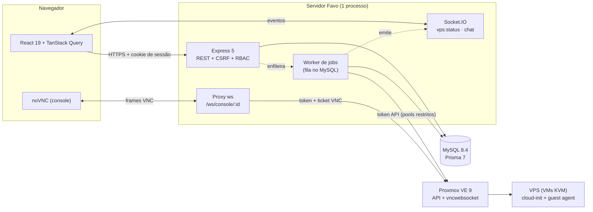
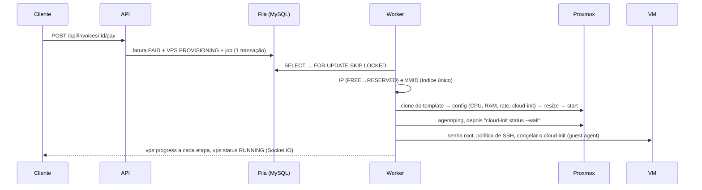
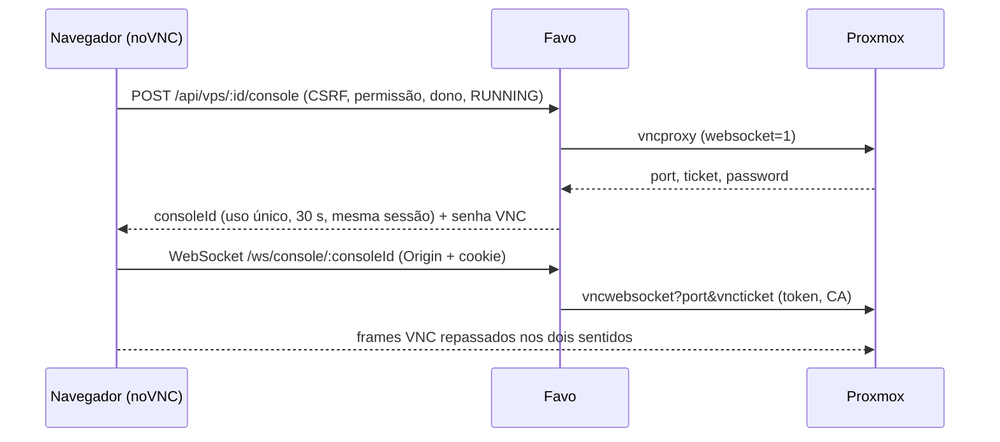

# Arquitetura da Favo

Este documento resume como a plataforma funciona por dentro. As decisões completas, com as alternativas avaliadas e
os testes feitos no laboratório, estão no [plano de implementação](PLANO_DE_IMPLEMENTACAO.md).

## Visão geral

Um único processo Node serve tudo: a API REST, o Socket.IO, o proxy do console e a SPA React. O mesmo processo roda o
worker da fila de jobs, que fala com o Proxmox pela API, usando um token com permissões mínimas.



| Camada | Tecnologia | Onde |
|---|---|---|
| Frontend | React 19, Vite 8, Tailwind 4, shadcn, TanStack Query, i18next (pt-BR, en-US, es-ES) | `src/client/` |
| API | Express 5, zod, tsyringe (DI com `@inject` explícito), pino | `src/server/http`, `controllers`, `services` |
| Tempo real | Socket.IO 4.8 (eventos), `ws` 8 (proxy do console) | `src/server/realtime/` |
| Dados | MySQL 8.4 + Prisma 7 (adapter MariaDB) | `prisma/`, `src/server/repositories/` |
| Virtualização | API REST do Proxmox VE 9 (undici + CA própria), guest agent | `src/server/integrations/proxmox/` |
| Contratos | DTOs, schemas zod, permissões, eventos e máquina de estados compartilhados | `src/shared/` |

## Ciclo de vida de uma VPS

A VPS é uma VM KVM clonada (linked clone) de um template "golden image" com cloud-init e o `qemu-guest-agent`.

```mermaid
stateDiagram-v2
  [*] --> PENDING_PAYMENT: pedido
  PENDING_PAYMENT --> PROVISIONING: pagamento aprovado
  PENDING_PAYMENT --> DELETED: excluir / fatura vencida
  PROVISIONING --> RUNNING: job provision_vps
  PROVISIONING --> ERROR: falha definitiva (VM parcial apagada, IP devolvido)
  RUNNING --> STOPPING --> STOPPED
  STOPPED --> STARTING --> RUNNING
  RUNNING --> REBOOTING --> RUNNING
  RUNNING --> UPDATING: trocar plano
  STOPPED --> UPDATING
  UPDATING --> RUNNING
  UPDATING --> STOPPED
  RUNNING --> DELETING
  STOPPED --> DELETING
  ERROR --> DELETING
  DELETING --> DELETED
```

- **Uma operação por vez:** cada transição é um `updateMany … WHERE status IN (…)`. Se nenhuma linha muda, a resposta é
  `409 VPS_BUSY`. É um lock otimista, sem transação longa. A mesma tabela (`VPS_TRANSITIONS`) habilita os botões na tela.
- **Outbox:** a mudança de estado e o job entram na mesma transação, então nunca fica "VPS em transição sem job".

### Provisionamento (`provision_vps`)



- **Idempotente e retomável:** cada passo grava um checkpoint no payload do job e confere o estado real no Proxmox antes
  de agir. Matar o servidor no meio e subir de novo retoma o job, na mesma VM (testado no laboratório).
- **Segredos:** as senhas escolhidas no pedido ficam cifradas com AES-256-GCM até o uso e são apagadas depois. Nunca
  ficam em texto puro no banco.
- **Cloud-init só no 1º boot:** no fim, o job grava `/etc/cloud/cloud-init.disabled`. Mudar a config de cloud-init de
  uma VM já criada troca o `instance-id`, e o cloud-init rodaria de novo, regenerando as chaves de host SSH. Por isso
  renomear, expandir o disco, trocar senhas e adicionar chaves são feitos pelo guest agent, com comandos fixos por família
  de imagem (`ImageProfile`).
- **Reconciliação:** a cada 60 s, o job `reconcile` compara o banco com o pool do Proxmox e corrige o status (VM
  desligada pela interface do Proxmox → `STOPPED`; VM sumiu → `ERROR`).

## Console (noVNC)

O navegador nunca fala com o Proxmox: o token da plataforma não pode sair do servidor, e o Proxmox fica numa rede interna
com certificado próprio.



Limites: 2 consoles por usuário, encerramento após 15 min sem tráfego, e revogar a sessão fecha o console. Técnicos de
suporte não têm console.

## Suporte (chat e fila)

- O cliente abre uma conversa (no máximo uma aberta) e entra na fila com posição.
- O técnico vê a fila ao vivo e assume a conversa. O `updateMany … WHERE status = 'WAITING'` é atômico: com dois
  cliques ao mesmo tempo, só um vence, e o outro recebe `409 ALREADY_CLAIMED`.
- Abrir, assumir, devolver e encerrar são rotas REST com CSRF. As mensagens vão pelo Socket.IO com ack (a mensagem
  otimista é trocada pela persistida). Depois de uma queda, a tela busca `?after=<último id>`.
- O técnico só vê o nome, o e-mail e as mensagens do cliente: nenhuma rota de VPS ou de fatura.

## Segurança (resumo)

Detalhes e checklist em [seguranca.md](seguranca.md).

- Sessão no banco (só o SHA-256 do token), cookie `HttpOnly; SameSite=Strict`, expiração deslizante com teto absoluto.
- CSRF *Signed Double-Submit Cookie*: HMAC ligado à sessão e enviado no header `X-CSRF-Token`, mais a checagem de `Origin`.
- RBAC: uma role por usuário e checagem por **permissão** (`requirePermission`), nunca pelo nome da role.
- Token do Proxmox restrito a dois pools e a uma role mínima: ele não consegue apagar os templates (`403`, testado).

## Testes

| Nível | Ferramenta | O que cobre |
|---|---|---|
| Unidade + integração HTTP/socket | Vitest + supertest + banco de teste | Regras, middlewares, permissões, concorrência (claim, pagamento), fila, jobs e chat com o `FakeVirtualizationProvider` |
| Laboratório (`@lab`) | Vitest contra o Proxmox real | As 4 imagens pelo provider; roteiro completo da VPS (criar, ligar, desligar, reiniciar, trocar plano, renomear, console, excluir) |
| E2E | Playwright | Fluxos no navegador em pt-BR e en-US (troca para es-ES) e o chat com 3 contextos, contra o app com o provider falso |

Comandos: `npm test`, `npm run test:coverage`, `npm run test:e2e`, `npm run test:lab` (exige o laboratório).
